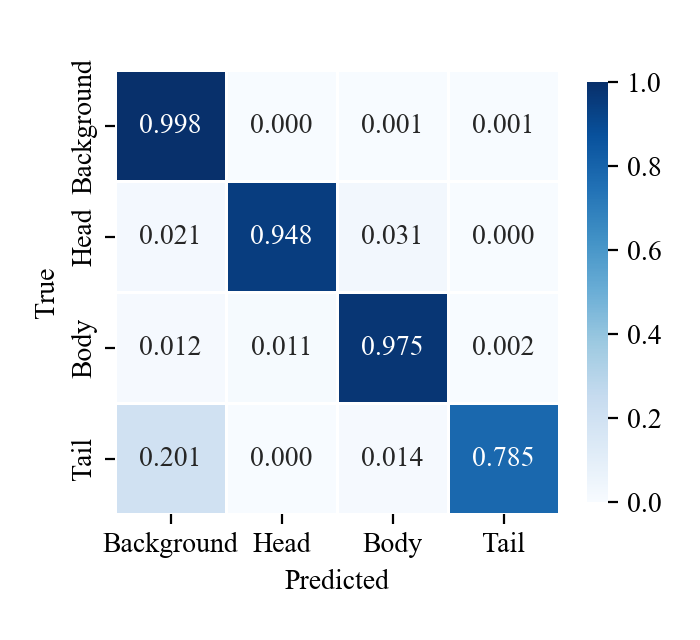

# `models/`

Trained U-Net + ResNet-34 checkpoints from the 5-fold subject-level
cross-validation described in the paper's *Technical Validation*
section.

## Bundled (git-tracked)

| File | Notes |
|------|-------|
| `unet_resnet34_fold2.pt` | The CV fold with the highest validation mIoU, shipped in the repository for [`code/data_sample/smoke_test.py`](../code/data_sample/smoke_test.py). |

Fold 2 is bundled because it has the highest validation mIoU among the
5-fold CV runs. Per-class IoU and validation mIoU on its held-out test
rats are reported in the paper's *Technical Validation* section.

*Aggregate normalized confusion matrix across the 5-fold cross-validation.*

